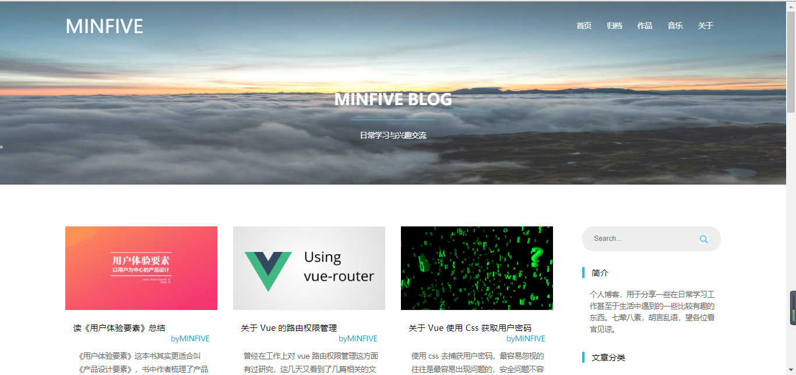
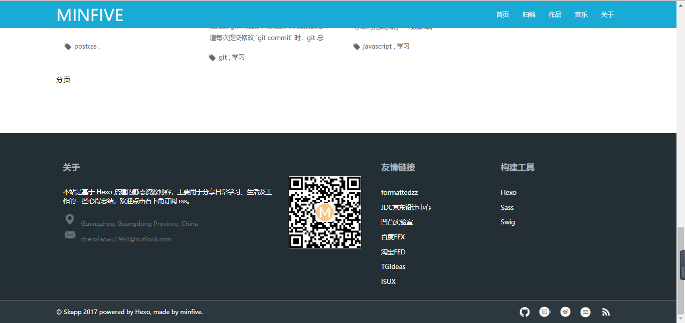
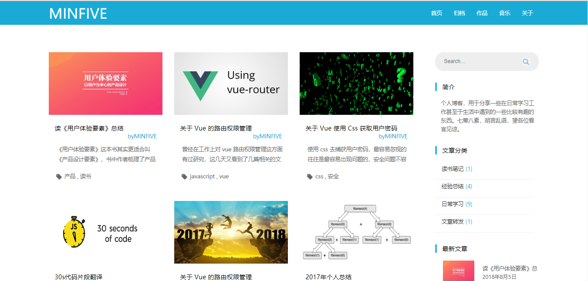
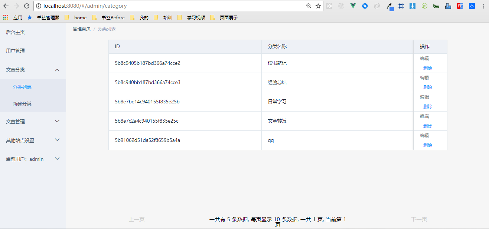
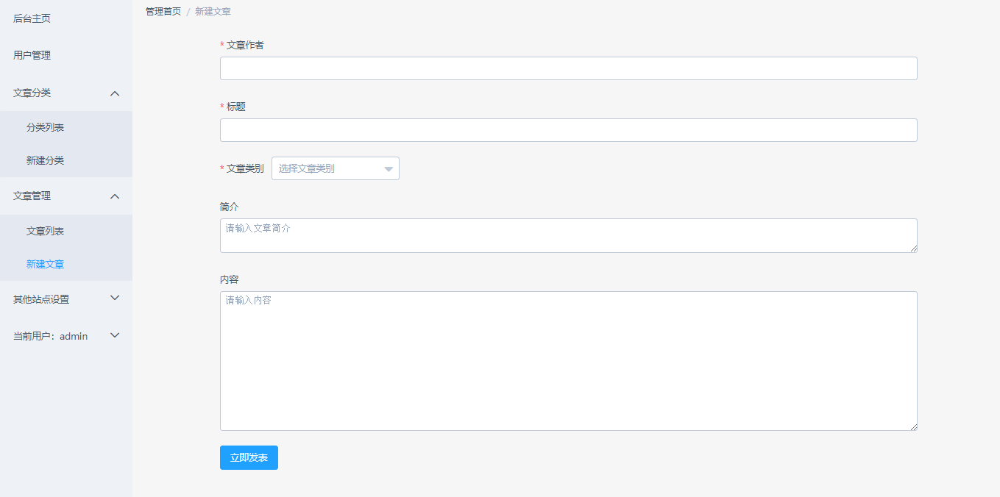
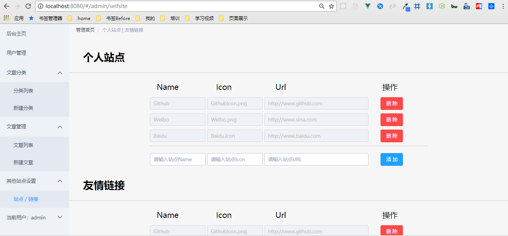

# 1、blog-font-end-service

##### 整个博客网站分为三大部分，分别是博客前端展示项目（blog-font）、博客后台管理项目（blog-end）、博客服务端项目（blog-service）；

## 2、目前实现的功能

> 1. 前端展示页面项目使用 Vue框架、Vue Router 搭建整个网站的静态布局与路由，数据暂时使用的是模拟服务端获取的 JSON 格式的数据；

> 2. 后台管理项目使用 Vue框架、ElementUI组件、Vue Router 搭建后台管理系统框架与路由，数据使用的是从服务端获取的 JSON 格式的数据；通过 CORS（跨来源资源共享）能够连接到服务端，来获取服务端的相关数据，实现了用户的注册/登陆与退出当前用户、用户管理界面、文章分类界面、博文管理界面、其他站点设置页面；

> 3. 服务端项目使用 NodeJs 书写服务端程序，该项目框架由 express 框架搭建，数据库操作由mongoose 模块支持，跨域 POST 请求发送的数据由 body-parser 模块支持；用户的登录信息保存功能由 cookies模块支持，完成了对后台管理项目的API接口对接；

## 3、还未实现的功能

> 1. 前端展示页面项目没有实现数据从服务器端进行动态获取，评论功能还没有实现，不同文章的分类还没实现，没有和服务器端项目进行数据接口对接；

> 2. 后台管理项目文章的图片还不能上传，Markdown语法书写的博文不能进行预览，文章的发布撤回功能还没有实现；

> 3. 服务端项目还没有实现对于图片数据的上传以及Markdown效果预览的功能，同时前端展示项目的API接口还没有实现，评论相关接口也没有实现；

# 4、安装教程

### 4.1 安装下载整个博客项目，运行下面的指令：

```bash
# 克隆整个项目到本地
$ git clone https://github.com/Geek-LHJ/blog-font-end-service.git
```
### 4.2 进入项目，对每个子项目进行第三方依赖的安装，在运行项目；

```bash
# 进入到 blog-font-end-service 项目的根目录下
$ cd blog-font-end-service
# 可以查看当前项目的文件目录情况
$ ls
```

#### 4.2.1 blog-font 前端展示项目安装、运行；

```bash
# 在 blog-font-end-service 项目的根目录下进入 blog-font 项目
$ cd blog-font
# 下载第三方依赖
$ npm install
# 在 blog-font 项目的根路径下运行项目，在浏览器输入：localhost:8080 进行查看
$ npm run dev
```

#### 4.2.2 blog-end 后台管理项目安装、运行；

```bash
# 在 blog-font-end-service 项目的根目录下进入 blog-end 项目
$ cd blog-end
# 下载第三方依赖
$ npm install
# 在 blog-end 项目的根路径下运行项目项目，在浏览器输入：localhost:8080 进行查看
$ npm run dev
```

#### 4.2.3 blog-service 服务端项目安装、运行；

```bash
# 在 blog-font-end-service 项目的根目录下进入 blog-font 项目
$ cd blog-service
# 下载第三方依赖
$ npm install
# 在 blog-service 项目的根路径下运行项目项目，前端页面的所有请求都必须经过 localhost:8000 端口，我们可以通过 postman 测试进测试行查看
$ node app.js
```
### 4.3 注意：

> 上述的后台管理项目需要配合服务器端项目以及 MongoDB 数据库一起运行，才能看到相关的效果，开启顺序是：

> 1. 先打开 MongoDB 数据库，运行数据库（bin 目录下进入cmd，输入 `mongo`）；

> 2. 再运行服务端程序（进入项目，输入 `node app.js`）

> 3. 最后运行后台管理项目，运行项目（项目目录下输入`npm run dev`）

> 4. 目前由于上传的项目文件没有包含数据库相关的数据，因而打开的页面没有数据，可以自行通过添加数据查看展示效果，可以测试请求数据的接口能否获取服务端项目数据，检验项目正常运行。

### 4.4 项目效果截图：

#### 4.4.1 前端展示项目
**1. 前端展示项目首页效果图片1**


**2. 前端展示项目首页效果图片2**


**3. 前端展示项目归档页面图片**


**4. 前端展示项目404页面**


**5. 前端展示项目关于页面**


#### 4.4.2 后台管理项目

**1. 后台登录页面**


**2. 后台注册页面**


**3. 后台首页欢迎页面**


**4. 后台用户管理页面**


**5. 后台文章分类列表页面**


**6. 后台文章分类添加页面**


**7. 后台文章列表页面**


**8. 后台新建文章页面**


**9. 后台其他站点设置页面**


#### 4.4.3 服务端项目

**1. 服务端项目成功运行截图**
