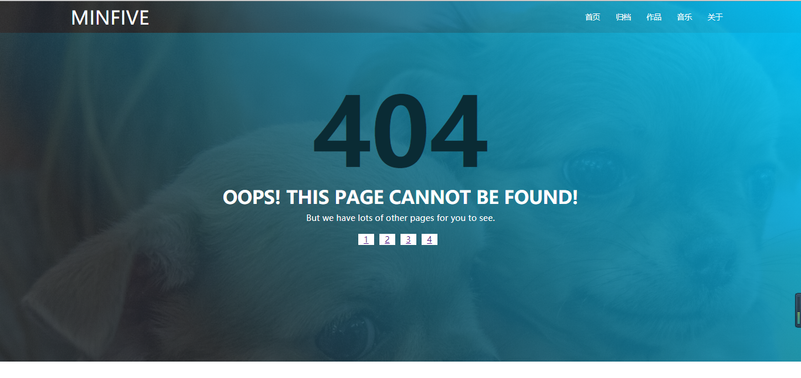
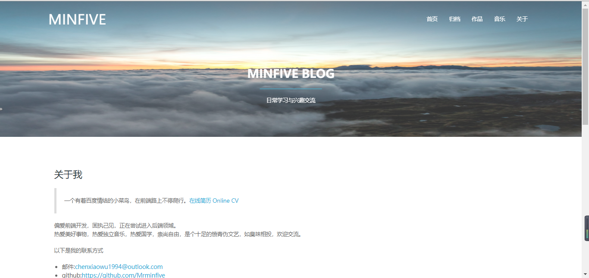

# 一、blog-front-19904（博客前端页面展示项目）

> 利用 Vue 框架开发的一个博客的前端页面项目

### （一）、设计需求

**参考下面这个博客网站，搭建自己的网站：
[博客网站地址——blog.minfive.com](http://blog.minfive.com/)**

> 1. 博客网站的动态布局；

> 2. 博客网站的路由切换，不同的页面导航；

> 3. 博客网站获取的数据的筛选；

> 4. 博客网站的关于页面评论，以及每篇博文的评论；

> 5. 评论区支持 Markdown 语法，并且能预览效果；

### （二）、所用的知识点

> 1. Flex 弹性布局，实现网站简单的动态效果；

> 2. 使用 Vue 框架进行整个网站的布局、Vue Router 对网站路由的实现；

> 3. 使用CORS（跨来源资源共享），来获取服务端博文的相关数据；

> 4. 使用vue-markdown 模块实现评论区Markdown的预览效果；

### （三）、目前项目实现的功能

> 1. 使用 Vue框架、Vue Router 搭建整个网站的静态布局与路由，数据暂时使用的是模拟服务端获取的 JSON 格式的数据；

> 2. 网站通过 Flex 弹性布局，实现了简单的动态效果；

> 3. CORS（跨来源资源共享）能够连接到服务端，来获取服务端的相关数据，但是暂时由于服务端的数据接口没有写好，没有实现数据的动态获取；

### （四）、还没有实现的功能

> 1. 首页以及归档页的数据进行 `filter`过滤，同时数据也需要通过跨域，从服务端获取最新的博文的数据；

> 2. 评论功能需要添加，包括实现 Markdown 的效果；


# 二、blog-front-19904 下载安装

## （一）、Demo 演示地址（暂无）


## （二）、安装教程

#### 1.下载整个项目，运行下面的指令：

```bash
git clone https://rdc.hand-china.com/gitlab/practical-training/blog-front-19904.git
```

#### 2.进入该项目，然后进行第三方依赖的安装，安装完成后运行整个项目：

```bash
cd blog-front-19904
# install dependencies
npm install
# serve with hot reload at localhost:8080
npm run dev
```

#### 3.在浏览器里面输入 localhost:8080 ，进行项目查看：

```m
localhost:8080
```

#### 4.项目效果截图：

**1. 首页效果图片1**


**2. 首页效果图片2**


**3. 归档页面图片**


**4. 404页面**


**5. 关于页面**


